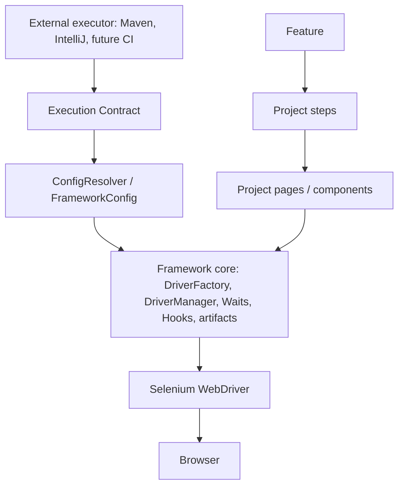

# Architecture

## Core vs project layer

**Framework core** is generic: `config`, `driver`, `hooks`, `utils/Waits`, `utils/ArtifactPaths`, logging, reports and Maven execution. It knows browser, timeout, scenario lifecycle and evidence; it does not know Sauce Demo, login credentials or business screens.

**Project/demo layer** is replaceable: `features`, `steps`, `pages`, `components`, `testdata` and business assertions. The current login example is a reference implementation, not a core dependency.

The boundary is enforced by direction: Feature -> Step -> Page/Component -> Core -> Selenium. Core must not import project classes. Pages must not call `ConfigLoader`; they receive the driver and configured timeout through the existing context.

## Extension points

| Change | Localized area |
|---|---|
| Edge browser | `BrowserType` and `DriverFactory` |
| Remote mode/Grid | `ExecutionMode` and `DriverFactory` |
| Screenshot/video/HAR evidence | hooks/evidence path layer |
| Reporter | Cucumber/Surefire reporting configuration |
| Environment | `resources/config` |

The stable public API is the Execution Contract: `ENV`, `BROWSER`, `HEADLESS`, `BASE_URL`, `TIMEOUT`, `EXECUTION_MODE` and `cucumber.filter.tags`. Internal parsers and helpers are implementation details.

## Why one Maven module

There is one consumer today, so a multi-module `qa-core` would add release and dependency overhead without reuse. Extract it only when multiple projects need an independently versioned/published core or duplicated maintenance becomes measurable.
